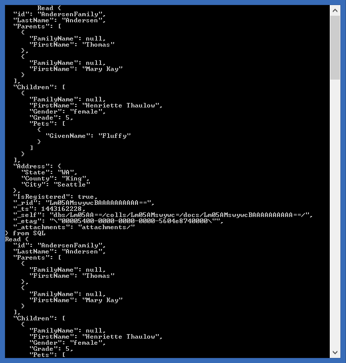

# Developing a .NET console app using DocumentDB
This sample shows you how to use the Microsoft Azure DocumentDB service to store and access data from a .NET console application.

For a complete end-to-end walkthrough of creating this application, please refer to the [full tutorial on the Azure documentation page](https://azure.microsoft.com/documentation/articles/documentdb-get-started/).

## Running this sample

1. Before you can run this sample, you must have the following prerequisites:
	- An active Azure DocumentDB account - If you don't have an account, refer to the [Create a DocumentDB account](https://azure.microsoft.com/en-us/documentation/articles/documentdb-create-account/) article.
	- Visual Studio 2013 (or higher).

2.Clone this repository using Git for Windows (http://www.git-scm.com/), or download the zip file.

3.From Visual Studio, open the **GetStarted.sln** file from the root directory.

4.In Visual Studio Build menu, select **Build Solution** (or Press F6). 

5.Retrieve the URI and PRIMARY KEY (or SECONDARY KEY) values from the Keys blade of your DocumentDB account in the Azure Preview portal. For more information on obtaining endpoint & keys for your DocumentDB account refer to [How to manage a DocumentDB account](https://azure.microsoft.com/en-us/documentation/articles/documentdb-manage-account/#keys)

If you don't have an account, see [Create a DocumentDB database account](https://azure.microsoft.com/en-us/documentation/articles/documentdb-create-account/) to set one up.

6.In the **App.config** file, located in the src directory, find **endpoint** and **authKey** and replace the placeholder values with the values obtained for your account.

    <add key="EndPointUrl" value="~your DocumentDB endpoint here~" />
    <add key="AuthorizationKey" value="~your auth key here~" />

7.You can now run and debug the application locally by pressing **F5** in Visual Studio.

## About the code
The code included in this sample is intended to get you quickly started with a .NET console application that connects to Azure DocumentDB.

## More information

- [Azure DocumentDB Documentation](https://azure.microsoft.com/documentation/services/documentdb/)
- [Azure DocumentDB .NET SDK](https://www.nuget.org/packages/Microsoft.Azure.DocumentDB/)
- [Azure DocumentDB .NET SDK Reference Documentation](https://msdn.microsoft.com/library/azure/dn948556.aspx)
